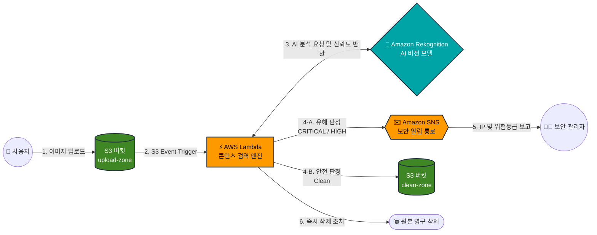

# AWS--1
하나하나 차근차근 aws 정복

## 📝 프로젝트 개요 (Overview)
본 프로젝트는 AWS 서버리스 아키텍처와 AI 비전 모델을 활용하여, 클라우드 저장소(S3)에 업로드되는 이미지를 실시간으로 분석하고 유해 콘텐츠를 자동으로 차단하는 **지능형 보안 검역 시스템**입니다.

## 🌟 핵심 기능 (Key Features)
* **실시간 유해물 탐지**: Amazon Rekognition을 활용하여 부적절한 이미지(폭력, 무기, 노출 등)를 업로드 즉시 식별합니다.
* **서버리스 자동 방어**: AWS Lambda를 통해 유해물 판정 시 즉시 파일을 영구 삭제하여 저장소 오염을 방지합니다.
* **지능형 보안 리포트**: AI 신뢰도에 따라 위험 등급(CRITICAL/HIGH)을 분류하고, S3 이벤트에서 업로더의 IP 주소를 추적하여 Amazon SNS로 관리자에게 긴급 알림을 전송합니다.
* **안전 파일 계층화**: 검역을 무사히 통과한 안전한 파일만 별도의 Clean 버킷(clean-zone)으로 안전하게 이동시킵니다.

## 🛠️ 기술 스택 (Tech Stack)
* **Cloud Infrastructure**: AWS S3, AWS Lambda, Amazon SNS, AWS IAM
* **AI / ML**: Amazon Rekognition
* **Language**: Python 3.12 (Boto3)

## 💡 트러블슈팅 및 보안 최적화 (Troubleshooting)
**1. 검역 신뢰도(Confidence) 민감도 튜닝**
초기 설정값(`MinConfidence=70`)에서는 배경이 복잡한 무기 사진 등이 통과되는 취약점을 발견했습니다. 보안성을 극대화하기 위해 `MinConfidence` 수치를 대폭 하향 조정하여, 시스템이 미세한 위협 요소라도 감지할 경우 즉시 격리 조치하도록 검역 기준을 강화했습니다.

**2. 관리자 가시성 확보 (IP Tracking)**
단순히 파일을 삭제하는 것을 넘어, 보안 사고 발생 시 사후 추적이 가능하도록 S3 Event 레코드 파라미터에서 `sourceIPAddress`를 추출하는 로직을 Lambda에 추가했습니다. 이를 통해 알림 메일에 공격 의심 IP를 포함시켜 실무 수준의 대응력을 갖추었습니다.
